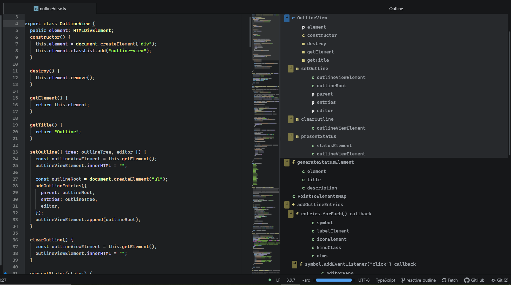

# atom-ide-outline

Outline UI compatible with IDE packages. Presents symbols of an active text editor in a tree view, with "jump to symbol" navigation (on click).

## Getting started

1. Install `atom-ide-outline` in Atom

2. Install relevant IDE language packages e.g.:

- [ide-typescript](https://atom.io/packages/ide-typescript) for TypeScript and JavaScript
- [ide-css](https://atom.io/packages/ide-css) for CSS
- [ide-python](https://atom.io/packages/ide-python) for Python
- [ide-rust](https://atom.io/packages/ide-rust) for Rust
- [ide-go](https://atom.io/packages/ide-go) for Go

For support for other language/syntax, try searching [Atom packages registry](https://atom.io/packages/search?q=ide-) - `ide-` prefix is unofficial, but helps narrow down the amount of results.

## Contributing

Take a look at [Contributing Guide](CONTRIBUTING.md).
