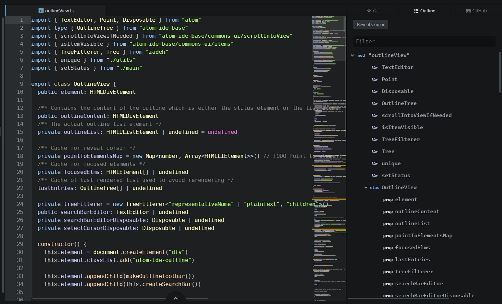
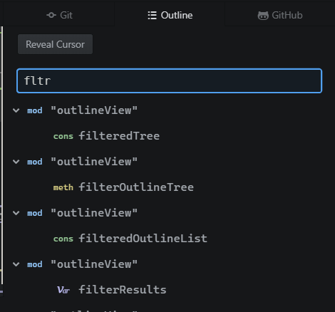
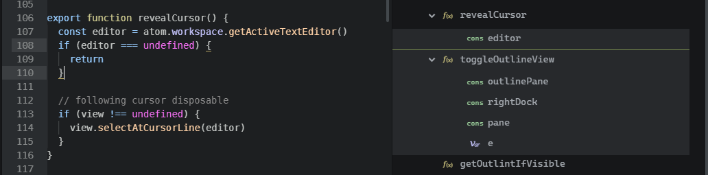
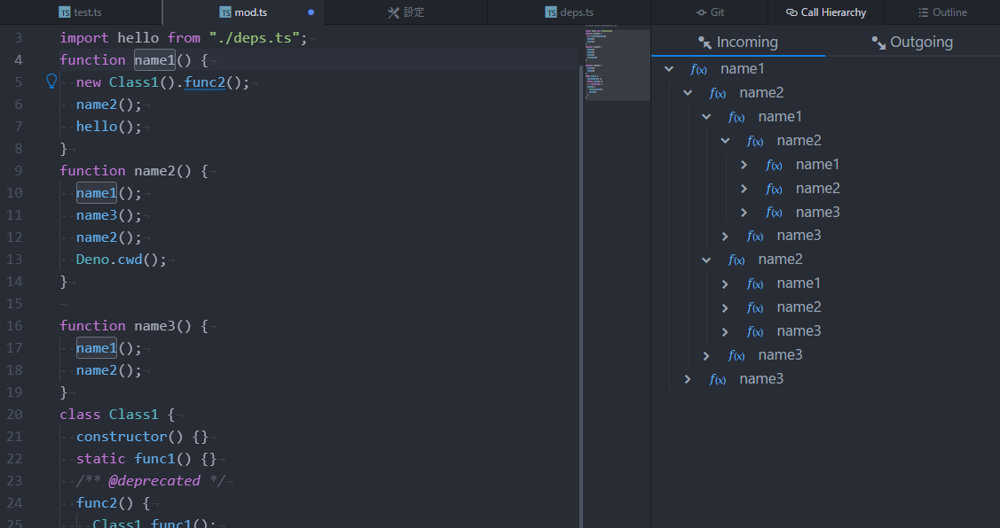

# atom-ide-outline

Outline UI compatible with IDE packages. Presents symbols of an active text editor in a tree view, with "jump to symbol" navigation (on click).

Fuzzy search in the outline tree powered by [Zadeh](https://github.com/atom-community/zadeh)

Reveal the current cursor in the outline

Show function call hierarchy (alt-c)

Double-click the function name to go to the definition.

## Getting started

1. Install `atom-ide-outline` in Atom

2. Install relevant IDE language packages e.g.:

- [atom-typescript](https://atom.io/packages/atom-typescript) for TypeScript
- [atom-ide-javascript](https://atom.io/packages/atom-ide-javascript) for JavaScript
- [ide-html](https://atom.io/packages/ide-html) for html
- [ide-css](https://atom.io/packages/ide-css) for CSS
- [ide-python](https://atom.io/packages/ide-python) for Python
- [ide-rust](https://atom.io/packages/ide-rust) for Rust
- [ide-go](https://atom.io/packages/ide-go) for Go

For support for other language/syntax, try searching [Atom packages registry](https://atom.io/packages/search?q=ide-) - `ide-` prefix is unofficial, but helps narrow down the amount of results.

## Contributing

Take a look at [Contributing Guide](CONTRIBUTING.md).
